---
tags:
  - ublue
  - bluefin
  - year-end-report
  - project-health
last_updated: 2025-12-21
---

# Bluefin 2025 Year-End Report

## Executive Summary

Project Bluefin has experienced transformative growth in 2025, evolving from an experimental desktop Linux distribution into a mature, cloud-native operating system with significant architectural improvements and community adoption. The project has successfully transitioned to a modular architecture centered around [@projectbluefin/common](https://github.com/projectbluefin/common), launched experimental initiatives like distroless and Wolfi-based variants, and maintained exceptionally high development velocity with daily automated updates and community contributions from dozens of active contributors.

**Key Achievements:**
- **3,900+ GitHub stars** on [@ublue-os/bluefin](https://github.com/ublue-os/bluefin) (primary repository)
- **Major architectural refactor** with the creation of [@projectbluefin/common](https://github.com/projectbluefin/common) OCI layer
- **Active daily development** with automated dependency management via Renovate
- **Growing projectbluefin organization** with 15 repositories spanning documentation, infrastructure, and experimental variants
- **Containerization-first philosophy** delivering on the promise of "the best distro is no distro"

## Project Mission & Vision

From [@ublue-os/bluefin](https://github.com/ublue-os/bluefin) README:

> Bluefin's mission is to provide a robust, cloud-native desktop operating system that bridges the gap between consumer usability and enterprise-grade infrastructure practices.

**Core Principles:**
- **Reliability**: Atomic updates ensuring system stability
- **Developer Experience**: Integrated cloud-native tooling and workflows, including Kubernetes and container support
- **Sustainability**: Reduced maintenance overhead for contributors by using the latest cloud native infrastructure tools

## Repository Architecture & Organization

Bluefin operates across two GitHub organizations with complementary purposes:

### @ublue-os Organization

The **primary development repository** remains [@ublue-os/bluefin](https://github.com/ublue-os/bluefin), which serves as:
- The main OCI image build infrastructure
- Integration point for all Bluefin variants (bluefin, bluefin-dx, bluefin-lts)
- Primary issue tracking and community engagement hub
- Source of truth for release artifacts

**Statistics (as of December 2024):**
- **3,900+ stars**
- **Active daily commits** (automated and manual)
- **100+ contributors** over project lifetime
- **Multiple variants**: Standard, DX (Developer Experience), LTS

### @projectbluefin Organization

Created in 2024, [@projectbluefin](https://github.com/projectbluefin) represents the **architectural evolution** of Bluefin:

| Repository | Purpose | Stars | Status |
|-----------|---------|-------|--------|
| [@projectbluefin/common](https://github.com/projectbluefin/common) | Shared OCI layer for all Bluefin variants | 8 | Active |
| [@projectbluefin/documentation](https://github.com/projectbluefin/documentation) | Official docs at docs.projectbluefin.io | 19 | Active |
| [@projectbluefin/website](https://github.com/projectbluefin/website) | Marketing site at projectbluefin.io | 10 | Active |
| [@projectbluefin/distroless](https://github.com/projectbluefin/distroless) | Experimental distroless variant | 32 | Active |
| [@projectbluefin/wolfifin](https://github.com/projectbluefin/wolfifin) | Wolfi OS-based experiment | 25 | Active |
| [@projectbluefin/finpilot](https://github.com/projectbluefin/finpilot) | Custom Bluefin template | 19 | Template |
| [@projectbluefin/iso](https://github.com/projectbluefin/iso) | ISO build infrastructure | 4 | Active |
| [@projectbluefin/egg](https://github.com/projectbluefin/egg) | Bluefin buildstream | 7 | Active |
| [@projectbluefin/brew](https://github.com/projectbluefin/brew) | Homebrew tarball integration | 14 | Archived |
| [@projectbluefin/wolfi-gnome](https://github.com/projectbluefin/wolfi-gnome) | GNOME packaging for Wolfi | 10 | Active |

## Major Architectural Developments in 2025

### 1. Creation of [@projectbluefin/common](https://github.com/projectbluefin/common)

**Launched:** November 2024

The most significant architectural change in 2025 was the extraction of shared configuration into a dedicated OCI layer. This repository consolidates:

**System Configuration (`/etc/ublue-os/`):**
- Bling CLI theming settings
- Fastfetch system information display
- Setup configuration for first-boot experience

**User-Space Configuration (`/usr/share/ublue-os/`):**
- Firefox default settings
- Flatpak application overrides
- Homebrew Brewfiles for curated application bundles
- Just command recipes for system management
- Message of the Day (MOTD) templates
- Setup hooks for privileged, system, and user initialization

**Recent Significant Additions (December 2024):**
- **ublue-bling**: CLI theming and branding system
- **ublue-signing**: Secure boot signing infrastructure
- **udev rules**: Hardware compatibility rules with documentation
- **polkit rules**: System authentication policies
- **fastfetch integration**: System information display
- **bazaar configuration**: Application discovery tool settings
- **TPM2 auto-unlock**: Automated LUKS disk encryption

**Key Brewfiles for Application Management:**
- `full-desktop.Brewfile` - 58 GNOME Circle and quality apps
- `fonts.Brewfile` - Additional monospace development fonts
- `cli.Brewfile` - CLI tools and utilities
- `ai-tools.Brewfile` - AI and machine learning tools (LM Studio, Ollama, etc.)
- `cncf.Brewfile` - Cloud Native Computing Foundation tools
- `k8s-tools.Brewfile` - Kubernetes ecosystem tools
- `ide.Brewfile` - VSCode, VSCodium, JetBrains Toolbox
- `artwork.Brewfile` - Design and creative applications

### 2. Distroless Experiments

**[@projectbluefin/distroless](https://github.com/projectbluefin/distroless)** - "The best distro, is no distro"

Launched in November 2024 with **32 stars** already, this experimental repository explores a truly distroless approach to Bluefin, removing traditional distribution components while maintaining the desktop experience. This aligns with modern cloud-native principles of minimal attack surfaces and reduced maintenance overhead.

### 3. Wolfi-based Variants

**[@projectbluefin/wolfifin](https://github.com/projectbluefin/wolfifin)** and **[@projectbluefin/wolfi-gnome](https://github.com/projectbluefin/wolfi-gnome)**

These experimental repositories explore building Bluefin on Chainguard's [Wolfi OS](https://www.chainguard.dev/unchained/introducing-wolfi-the-first-linux-un-distro), a minimal Linux distribution designed for containers with:
- Melange package building system
- Supply chain security focus
- bootc (bootable container) compatibility
- Minimal attack surface

## Development Activity & Velocity

### Commit Patterns (Past 60 Days)

Analysis of [@ublue-os/bluefin](https://github.com/ublue-os/bluefin) repository activity:

**Notable Contributors (Last 60 Days):**

| Contributor | Organization | Recent Focus |
|-------------|--------------|--------------|
| @ubot-7274[bot] | Universal Blue | Automated dependency updates (Renovate) |
| @castrojo | Independent | Project leadership, feature integration, Brewfile curation |
| @renner0e | Community | Infrastructure refactoring, common layer development |
| @tulilirockz | Community | Build system improvements, ublue-bling, polkit/udev rules |
| @inffy | Community | CI/CD improvements, renovation automation |
| @web-flow | GitHub | Merge commits (automation) |
| @salaniz | Community | Kernel module fixes |
| @befanyt | Community | Update management improvements |
| @hanthor | Community | Justfile recipes, CNCF tooling |

### Automation & Continuous Integration

Bluefin maintains **exceptional automation discipline**:

**Daily Automated Updates:**
- Renovate bot (`@ubot-7274`) submits multiple PRs daily for:
  - Base Silverblue image updates from [@ublue-os/silverblue-main](https://github.com/ublue-os/silverblue-main)
  - [@projectbluefin/common](https://github.com/projectbluefin/common) OCI layer updates
  - GitHub Actions updates
  - Build tooling updates

**Example commit patterns from recent history:**
```
- chore(deps): update ghcr.io/ublue-os/silverblue-main:latest docker digest to 8f5fe6d
- chore(deps): update ghcr.io/projectbluefin/common:latest docker digest to d2443da
- chore(deps): update actions/upload-artifact action to v6
```

This level of automation ensures Bluefin users receive security updates and improvements rapidly, often within hours of upstream changes.

### Recent Major Features (December 2024)

| Date | Feature | PR/Commit | Impact |
|------|---------|-----------|--------|
| Dec 20 | **Add containerd** | [#3877](https://github.com/ublue-os/bluefin/commit/e29f12170a33ff4616868fec83d389b6734cb04c) | Expanded container runtime options |
| Dec 16 | **Bring back Renovate** | [#3853](https://github.com/ublue-os/bluefin/commit/4c174dc66384b78d4b4fa8a4f20f93673011dcc9) | Re-enabled automated dependency management |
| Dec 13 | **Move wallpapers to common** | [#3826](https://github.com/ublue-os/bluefin/commit/35d040afc34fa18865b30b4f1bc300c09b0f620e) | Further consolidation into common layer |
| Dec 12 | **Remove kernel-devel from rpmdb** | [#3815](https://github.com/ublue-os/bluefin/commit/44421611c94ff492f250c5545f48e57cdd4a7a37) | Image size optimization |
| Dec 7 | **Use shared directory from common** | [#3790](https://github.com/ublue-os/bluefin/commit/367e663ef45abb6dbce28dbddc30fbc54284a9e5) | Architecture consolidation |
| Dec 7 | **Add nvidia, homebrew and just tests** | [#3786](https://github.com/ublue-os/bluefin/commit/c81ec1d4534ae3fbfdb7524dd1e4ab0bb17a519e) | Quality assurance improvements |
| Dec 4 | **Port bazaar config to new version** | [#3737](https://github.com/ublue-os/bluefin/commit/dbf592f33b95f26dbf815a4c6d4f22987dd908e2) | Application discovery improvements |
| Dec 1 | **Clean up a bunch of stuff from the image** | [#3751](https://github.com/ublue-os/bluefin/commit/728e775c8b806755ef8c41f56c71caa5363f222c) | Image refinement and cleanup |

## [@projectbluefin/common](https://github.com/projectbluefin/common) Deep Dive

The `common` repository represents a **paradigm shift** in how Bluefin manages shared configuration:

### Architecture Pattern

```dockerfile
FROM ghcr.io/ublue-os/bluefin-common:latest AS bluefin-common

# Copy all system files
COPY --from=bluefin-common /system_files /
```

This pattern allows:
- **Separation of concerns**: Aurora can use `/etc` configs while maintaining different opinions in `/usr/share`
- **Rapid iteration**: Changes to common configuration deploy to all variants simultaneously
- **Clear ownership**: Common functionality lives in one place
- **OCI native**: Leverages container layer caching and distribution

### Development Velocity on Common (Dec 2024)

From recent commit history on [@projectbluefin/common](https://github.com/projectbluefin/common):

| Date | Commit Message | Contributor |
|------|---------------|-------------|
| Dec 20 | fix: also install cli.Brewfile for bluefin-cli | @renner0e |
| Dec 20 | feat(ublue-bling): clean up script considerably | @tulilirockz |
| Dec 19 | feat(just): add clean-system back | @renner0e |
| Dec 19 | chore: update CNCF tooling in Brewfiles | @hanthor |
| Dec 18 | fix: toggle-tpm2 recipe when NO pin is used | @inffy |
| Dec 16 | feat: add logos (bluefin-cli, plymouth) | @renner0e |
| Dec 14 | feat: add ublue-motd with envsubst | @tulilirockz |
| Dec 14 | feat: move ublue-setup-services to common | @tulilirockz |
| Dec 13 | feat: add ublue-bling | @renner0e |
| Dec 13 | feat: add contents of ublue-os-udev-rules | @tulilirockz |
| Dec 13 | feat: add contents of ublue-os-signing | @tulilirockz |
| Dec 13 | feat: rewrite luks autounlock with gnomeOS instructions | @tulilirockz |
| Dec 13 | feat: add wallpapers | @renner0e |
| Dec 9 | feat: move bazaar config to common repo | @dreamyukii |
| Dec 9 | feat: add full-desktop Brewfile with GNOME Circle apps | @castrojo |
| Nov 24 | chore: move everything related to ujust and brew to common | @tulilirockz |

**Key insight:** The `common` repository had **69+ commits in December alone**, demonstrating it as a highly active consolidation and improvement effort.

## Documentation & Community Resources

### Official Documentation

**[@projectbluefin/documentation](https://github.com/projectbluefin/documentation)** - [docs.projectbluefin.io](https://docs.projectbluefin.io)

- **19 stars**, **53 forks**
- Built with **Docusaurus** (TypeScript)
- Sparse by design: "Docs linking to upstream documentation directly with a short summary is preferred"
- Philosophy: Bluefin should be "invisible" - minimal documentation surface area
- Active daily contributions

### Marketing & Presence

**[@projectbluefin/website](https://github.com/projectbluefin/website)** - [projectbluefin.io](https://projectbluefin.io)

- **10 stars**, **33 forks**
- Built with **Vue.js**
- Features interactive "scene picker" for variant selection
- Topics: `bootc` (bootable containers)

### Community Forum

- **Discourse instance**: [community.projectbluefin.io](https://community.projectbluefin.io/)
- Primary support and discussion venue
- Recommended over GitHub Discussions

### Official Blog

- **Location**: [blog.projectbluefin.io](https://blog.projectbluefin.io/)
- Announcements and release notes
- Referenced in README as primary news source

## Bluefin Variants & Flavors

Bluefin offers multiple variants to serve different use cases:

### Production Variants

1. **bluefin** - Standard desktop experience
   - Consumer-focused
   - GNOME desktop environment
   - Flatpak-first application delivery

2. **bluefin-dx** - Developer Experience variant
   - Integrated cloud-native development tools
   - Container runtime (Podman, Docker, containerd)
   - Kubernetes tooling (kubectl, k9s, kind, minikube)
   - Development IDEs and language toolchains

3. **bluefin-lts** - Long-Term Support variant
   - Stable base from older Fedora releases
   - Extended maintenance window
   - Conservative update policy

### Build Streams

From the README badges and workflow names:

- **GTS (Get The Stable)** - Stable production builds
- **Stable** - General availability builds
- **Latest Main** - Bleeding edge from main branch

### Experimental Variants

- **[@projectbluefin/distroless](https://github.com/projectbluefin/distroless)** - Distroless exploration
- **[@projectbluefin/wolfifin](https://github.com/projectbluefin/wolfifin)** - Wolfi OS base
- **[@projectbluefin/finpilot](https://github.com/projectbluefin/finpilot)** - Custom build template

## Security & Infrastructure

### Secure Boot Support

From README:
- Secure Boot supported by default with custom Universal Blue key
- Password: `universalblue`
- Public key available at [@ublue-os/akmods](https://github.com/ublue-os/akmods)
- Manual enrollment via `ujust enroll-secure-boot-key`

### Signing & Verification

- **Cosign signing** for OCI images
- Custom signing key infrastructure in [@projectbluefin/common](https://github.com/projectbluefin/common)
- Build provenance and attestation

### Dependency Management

- **Renovate automation** via `@ubot-7274` bot
- Daily automated dependency PRs
- GitHub Actions workflow updates
- Base image digest tracking
- Merge queue support (added Dec 2024)

## Cloud-Native Developer Experience

Bluefin's value proposition for developers includes:

### Integrated Tooling (via -dx variant)

**Container Runtimes:**
- Podman (default)
- Docker
- containerd (added December 2024)

**Kubernetes Tools** (from k8s-tools.Brewfile):
- kubectl
- k9s
- kind
- minikube
- helm
- kustomize

**CNCF Tools** (from cncf.Brewfile):
Multiple Cloud Native Computing Foundation tools curated for cloud-native development

**AI/ML Tools** (from ai-tools.Brewfile):
- LM Studio (added December 2024)
- Ollama
- Various AI CLI tools
- GPU acceleration support

### Homebrew Integration

Bluefin uses **Homebrew** as a package manager for development tools:

- `bbrew` command for Brewfile-based installation
- Curated Brewfiles in [@projectbluefin/common](https://github.com/projectbluefin/common)
- Community-contributed tool collections
- Integration with [@ublue-os/homebrew-tap](https://github.com/ublue-os/homebrew-tap)

### Justfile System Management

`ujust` command provides declarative system management:

```bash
ujust                          # List available recipes
ujust update                   # System update
ujust install-system-flatpaks  # Install default apps
ujust bbrew                    # Install from Brewfiles
ujust toggle-tpm2              # LUKS auto-unlock
ujust clean-system             # System cleanup
```

## Community & Contributor Ecosystem

### Organizational Diversity

Based on commit history, major contributors represent:

- **Independent developers**: @castrojo, @renner0e, @dreamyukii, @hanthor, @befanyt, @spasche, @KiKaraage, @theMimolet
- **Community organizations**: @tulilirockz, @inffy, @salaniz
- **Automation**: @ubot-7274 (Renovate), @web-flow (GitHub), @Copilot (GitHub Copilot agent)

### First-Time Contributor Recognition

Multiple contributors made first contributions in December 2024:
- @dreamyukii - Bazaar configuration
- @KiKaraage - AI tools Brewfile additions
- @theMimolet - Font additions
- @spasche - Incus integration fixes
- @befanyt - Update management improvements

### Contributor Guidelines

From README and documentation:
- **Contributing guide**: [docs.projectbluefin.io/contributing](https://docs.projectbluefin.io/contributing)
- **Code of Conduct**: Universal Blue Community Guidelines
- **Communication**: Discourse forum strongly recommended over GitHub

### Maintainers

See [CODEOWNERS](https://github.com/ublue-os/bluefin/blob/main/.github/CODEOWNERS) for current maintainer list.

## Project Metrics & Analytics

### GitHub Activity

**[@ublue-os/bluefin](https://github.com/ublue-os/bluefin):**
- **3,900+ stars** (growing continuously)
- **100+ forks**
- **Open issues**: Actively triaged
- **Pull requests**: Multiple daily automated + manual PRs
- **Commit frequency**: 5-10+ commits per day (including automated)

**[@projectbluefin organization](https://github.com/projectbluefin):**
- **15 repositories**
- **170+ total stars** across all repos
- **120+ total forks**
- Active development across multiple experimental initiatives

### Community Engagement Metrics

From README analytics widgets:

**LFX Active Contributors:**
- Badge present showing Linux Foundation tracking
- Security vulnerability monitoring
- Active contributor metrics

**Repobeats Analytics:**
- Embedded analytics showing growth trends
- Commit activity visualization
- Contributor diversity metrics

**OSS Insight Widgets:**
- New participant trends (past 90 days)
- Active contributor trends (past 90 days)
- Organization-level visibility into @ublue-os activity

**Star History:**
- Historical star growth chart embedded
- Demonstrates steady adoption trajectory

### User Adoption

**Countme Badge:**
From README, Bluefin tracks active installations via DNF countme metrics, providing visibility into real-world adoption.

## Technical Architecture

### Base Stack

```
Bluefin Image
├── ghcr.io/ublue-os/silverblue-main (Fedora Silverblue base)
├── ghcr.io/projectbluefin/common (Shared configuration layer)
├── Bluefin-specific configuration
└── Variant-specific features (-dx, -lts)
```

### Container-Native Philosophy

From the mission statement, Bluefin embraces:

1. **OCI images** as the primary distribution mechanism
2. **Layered composition** for modularity
3. **Atomic updates** via OSTree/bootc
4. **Immutable base** with container primitives
5. **Declarative configuration** via Containerfiles

### Build Infrastructure

**[@projectbluefin/egg](https://github.com/projectbluefin/egg)** - "The buildstream for making Bluefin"
- 7 stars
- Contains build pipeline definitions
- Manages multi-stage build process

**[@projectbluefin/iso](https://github.com/projectbluefin/iso)** - ISO generation
- 4 stars
- Builds installation media from OCI images
- Just-based build automation

### Continuous Integration

**GitHub Actions workflows:**
- `build-image-gts.yml` - Stable builds
- `build-image-stable.yml` - General availability
- `build-image-latest-main.yml` - Bleeding edge
- Automated testing (nvidia, homebrew, just)
- Brewfile validation
- SBOM generation (Anchore)

## Challenges & Evolution

### Recent Refactoring Efforts

**November-December 2024 saw major cleanup:**

1. **Move to common layer**: Consolidated shared configuration (Nov-Dec)
2. **Remove deprecated features**: Cleaned up legacy code paths (Dec 1)
3. **Renovate automation**: Disabled and re-enabled with improvements (Dec 14-16)
4. **Testing infrastructure**: Added nvidia, homebrew, just tests (Dec 7)
5. **CI optimization**: Free space management, merge queue support (Dec 12-14)

### Technical Debt Addressed

From commit messages:
- Removed `kernel-devel` from rpmdb after `/usr/src` removal
- Fixed ZFS RPM pattern matching
- Unbreak dx builds after changes
- Fix toggle-tpm2 recipe logic
- Swap mutter version pinning logic
- Fix bazaar YAML blocklist configuration

### Community-Reported Issues

Based on commit references:
- Fixed uupd disable-module-distrobox for all versions
- Resolved bug report form issues
- Added missing Incus integration arguments
- Corrected MOTD toggle logic

## 2025 Goals Achievement Analysis

While specific goal documents weren't directly accessible in the repository analysis, evidence from development activity suggests focus on:

✅ **Architectural modernization** - [@projectbluefin/common](https://github.com/projectbluefin/common) consolidation complete

✅ **Developer experience** - Extensive Brewfile curation, containerd addition, AI tools

✅ **Experimental variants** - Distroless, Wolfifin initiatives launched

✅ **Documentation improvement** - Dedicated docs repository with active updates

✅ **Automation discipline** - Renovate integration, daily automated updates

✅ **Community growth** - Multiple new contributors, diverse organizational representation

## Repository and Container Relationship Diagram

```mermaid
graph TB
    subgraph "User-Facing Websites"
        WEBSITE[projectbluefin.io<br/>Marketing Site]
        DOCS[docs.projectbluefin.io<br/>Documentation]
        BLOG[blog.projectbluefin.io<br/>Announcements]
        FORUM[community.projectbluefin.io<br/>Discourse Forum]
    end

    subgraph "Primary Build Repository"
        BLUEFIN[ublue-os/bluefin<br/>Main Build Repo<br/>3900+ ⭐]
    end

    subgraph "Shared Infrastructure Layer"
        COMMON[projectbluefin/common<br/>OCI Configuration Layer<br/>8 ⭐]
        
        subgraph "Common Contains"
            BLING[ublue-bling<br/>CLI Theming]
            SIGNING[Secure Boot Signing]
            UDEV[Hardware Rules]
            POLKIT[Auth Policies]
            BREWFILES[Brewfiles<br/>App Bundles]
            UJUST[ujust Recipes]
            MOTD[System MOTD]
            FASTFETCH[System Info Display]
        end
    end

    subgraph "Base Images"
        SILVERBLUE[ublue-os/silverblue-main<br/>Fedora Silverblue Base]
    end

    subgraph "Build Output - Container Registry"
        REGISTRY[ghcr.io Container Registry]
        
        subgraph "Published Images"
            IMG_BLUEFIN[ghcr.io/ublue-os/bluefin<br/>Standard Variant]
            IMG_DX[ghcr.io/ublue-os/bluefin-dx<br/>Developer Variant]
            IMG_LTS[ghcr.io/ublue-os/bluefin-lts<br/>LTS Variant]
            IMG_COMMON[ghcr.io/projectbluefin/common<br/>Shared Layer]
        end
    end

    subgraph "Supporting Repositories"
        WEBSITE_REPO[projectbluefin/website<br/>Vue.js Site<br/>10 ⭐]
        DOCS_REPO[projectbluefin/documentation<br/>Docusaurus Docs<br/>19 ⭐]
        EGG[projectbluefin/egg<br/>Build Stream<br/>7 ⭐]
        ISO[projectbluefin/iso<br/>ISO Builder<br/>4 ⭐]
        FINPILOT[projectbluefin/finpilot<br/>Custom Template<br/>19 ⭐]
    end

    subgraph "Experimental Initiatives"
        DISTROLESS[projectbluefin/distroless<br/>Distroless Experiment<br/>32 ⭐]
        WOLFIFIN[projectbluefin/wolfifin<br/>Wolfi-based Build<br/>25 ⭐]
        WOLFI_GNOME[projectbluefin/wolfi-gnome<br/>GNOME for Wolfi<br/>10 ⭐]
    end

    subgraph "Automation & Config"
        RENOVATE[projectbluefin/renovate-config<br/>Dependency Automation]
        GITHUB_ORG[projectbluefin/.github<br/>Org Settings]
        BREW_REPO[projectbluefin/brew<br/>Homebrew Integration<br/>ARCHIVED]
    end

    subgraph "External Dependencies"
        HOMEBREW[ublue-os/homebrew-tap<br/>Homebrew Formulas]
        AKMODS[ublue-os/akmods<br/>Kernel Modules & Keys]
    end

    %% Build Flow
    SILVERBLUE -->|Base Layer| BLUEFIN
    COMMON -->|Configuration Layer| BLUEFIN
    BLUEFIN -->|Builds & Pushes| IMG_BLUEFIN
    BLUEFIN -->|Builds & Pushes| IMG_DX
    BLUEFIN -->|Builds & Pushes| IMG_LTS
    COMMON -->|Publishes| IMG_COMMON
    
    %% Common Layer Contents
    COMMON --> BLING
    COMMON --> SIGNING
    COMMON --> UDEV
    COMMON --> POLKIT
    COMMON --> BREWFILES
    COMMON --> UJUST
    COMMON --> MOTD
    COMMON --> FASTFETCH

    %% Container Registry
    IMG_BLUEFIN --> REGISTRY
    IMG_DX --> REGISTRY
    IMG_LTS --> REGISTRY
    IMG_COMMON --> REGISTRY

    %% Support Infrastructure
    WEBSITE_REPO -.->|Deploys to| WEBSITE
    DOCS_REPO -.->|Deploys to| DOCS
    EGG -.->|Build Coordination| BLUEFIN
    ISO -.->|Uses Images from| REGISTRY
    FINPILOT -.->|Template for Custom| BLUEFIN

    %% Experimental
    DISTROLESS -.->|Explores Alternative| BLUEFIN
    WOLFIFIN -.->|Alternative Base| SILVERBLUE
    WOLFI_GNOME -.->|Supports| WOLFIFIN

    %% Automation
    RENOVATE -.->|Configures Updates for| BLUEFIN
    RENOVATE -.->|Configures Updates for| COMMON
    GITHUB_ORG -.->|Org-wide Settings| BLUEFIN

    %% External Integration
    BREWFILES -->|References| HOMEBREW
    SIGNING -->|Uses Keys from| AKMODS
    
    %% User Flow
    WEBSITE -.->|User discovers| BLUEFIN
    DOCS -.->|User learns about| BLUEFIN
    FORUM -.->|User gets support for| BLUEFIN
    BLOG -.->|User stays informed about| BLUEFIN

    %% Styling
    classDef primary fill:#4A90E2,stroke:#2E5C8A,stroke-width:3px,color:#fff
    classDef infrastructure fill:#50C878,stroke:#2D7A4A,stroke-width:2px,color:#fff
    classDef experimental fill:#FF6B6B,stroke:#C92A2A,stroke-width:2px,color:#fff
    classDef website fill:#9B59B6,stroke:#6C3483,stroke-width:2px,color:#fff
    classDef container fill:#F39C12,stroke:#A6640F,stroke-width:2px,color:#fff
    
    class BLUEFIN primary
    class COMMON,EGG,ISO,FINPILOT infrastructure
    class DISTROLESS,WOLFIFIN,WOLFI_GNOME experimental
    class WEBSITE,DOCS,BLOG,FORUM,WEBSITE_REPO,DOCS_REPO website
    class REGISTRY,IMG_BLUEFIN,IMG_DX,IMG_LTS,IMG_COMMON container
```



## Key Architectural Insights from Diagram

### @projectbluefin/common as Central Hub

The `common` repository serves as the **configuration nucleus**:

1. **Single source of truth** for shared settings across all Bluefin variants
2. **Published as OCI layer** (`ghcr.io/projectbluefin/common:latest`)
3. **Independently versionable** - can be updated without rebuilding main images
4. **Consumed by copy** in Containerfile via `COPY --from=bluefin-common`

### Dual-Organization Strategy

**@ublue-os namespace:**
- Historical home, established community
- Active build infrastructure
- Primary user-facing repository
- Strong branding ("ublue-os/bluefin")

**@projectbluefin namespace:**
- Dedicated project identity
- Modular component repositories
- Experimental initiatives
- Future-facing architecture

### Three-Tier Artifact Structure

```
Tier 1: Base OS
└── ghcr.io/ublue-os/silverblue-main (Fedora Silverblue)

Tier 2: Shared Configuration
└── ghcr.io/projectbluefin/common (Universal Blue + Bluefin config)

Tier 3: Variant-Specific Images
├── ghcr.io/ublue-os/bluefin (consumer-focused)
├── ghcr.io/ublue-os/bluefin-dx (developer-focused)
└── ghcr.io/ublue-os/bluefin-lts (stability-focused)
```

Each tier can be updated independently, providing **flexible release cadences**:
- Tier 1 updates: Daily (Fedora upstream)
- Tier 2 updates: Multiple times daily (common layer refinements)
- Tier 3 updates: Triggered by either Tier 1 or 2 changes

## Risks & Recommendations

### Identified Risks

| Risk | Severity | Mitigation |
|------|----------|------------|
| **Dual-namespace confusion** | 🟡 Medium | Users may be unclear whether to track @ublue-os/bluefin or @projectbluefin repos |
| **Experimental repo proliferation** | 🟢 Low | Multiple experimental repos may fragment contributor attention |
| **Documentation sparseness** | 🟡 Medium | Intentional minimalism may leave users seeking deeper technical docs |
| **Renovation bot dependency** | 🟢 Low | Heavy reliance on automated PRs - bot failure could slow updates |
| **Common layer stability** | 🟡 Medium | Rapid changes to common (69+ commits in Dec) may introduce instability |

## Conclusion

Project Bluefin has matured significantly in 2025, transitioning from a monolithic build to a **modular, cloud-native architecture** that exemplifies its "best distro is no distro" philosophy. The creation of [@projectbluefin/common](https://github.com/projectbluefin/common) as a shared OCI layer represents a fundamental architectural improvement that will enable:

- **Faster iteration** on shared functionality
- **Clearer separation** between Universal Blue base and Bluefin opinions
- **Easier adoption** by downstream projects (Aurora already consuming common)
- **Reduced duplication** across variants

The project maintains **exceptional development velocity** with daily automated updates, active community contributions, and multiple experimental initiatives exploring the future of Linux desktop distribution. With over 3,900 stars, growing community engagement, and a clear technical vision, Bluefin is well-positioned for continued growth in 2026.

**Health Grade: A** (Excellent)

Bluefin demonstrates strong project health across all dimensions:
- ✅ Active daily development with multiple contributors
- ✅ Clear architectural vision and execution
- ✅ Robust automation and CI/CD
- ✅ Multiple experimental initiatives
- ✅ Strong community engagement infrastructure
- ✅ Excellent documentation for its minimalist philosophy
- ✅ Transparent development process

## References

### Primary Sources

- [@ublue-os/bluefin](https://github.com/ublue-os/bluefin) - Main repository
- [@projectbluefin/common](https://github.com/projectbluefin/common) - Shared configuration layer
- [@projectbluefin/documentation](https://github.com/projectbluefin/documentation) - Official docs
- [@projectbluefin organization](https://github.com/projectbluefin) - Project organization

### Official Resources

- [projectbluefin.io](https://projectbluefin.io/) - Official website
- [docs.projectbluefin.io](https://docs.projectbluefin.io/) - Documentation portal
- [blog.projectbluefin.io](https://blog.projectbluefin.io/) - Official blog
- [community.projectbluefin.io](https://community.projectbluefin.io/) - Community forum

### Related Universal Blue Projects

- [@ublue-os/silverblue-main](https://github.com/ublue-os/silverblue-main) - Base image
- [@ublue-os/akmods](https://github.com/ublue-os/akmods) - Kernel modules and signing
- [@ublue-os/homebrew-tap](https://github.com/ublue-os/homebrew-tap) - Homebrew formulas

---

**Report Generated:** December 21, 2025  
**Analysis Period:** Full year 2025, with detailed focus on November-December 2024    
**Data Sources:** GitHub API, repository file analysis, commit history analysis  
**Methodology:** Comprehensive repository analysis across @ublue-os and @projectbluefin organizations
